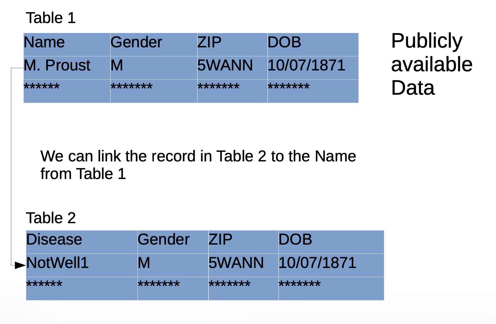
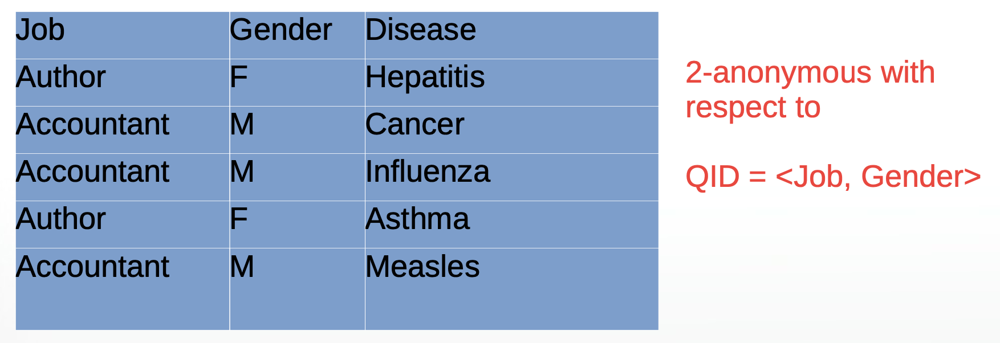
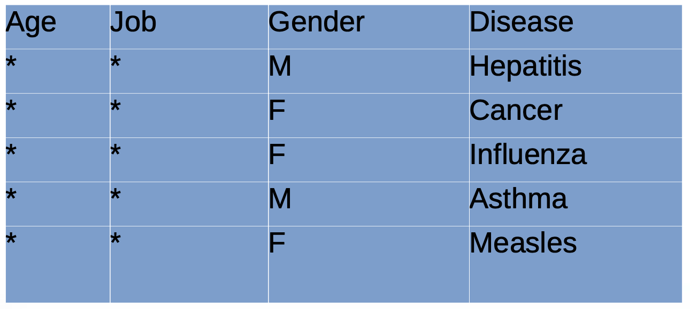
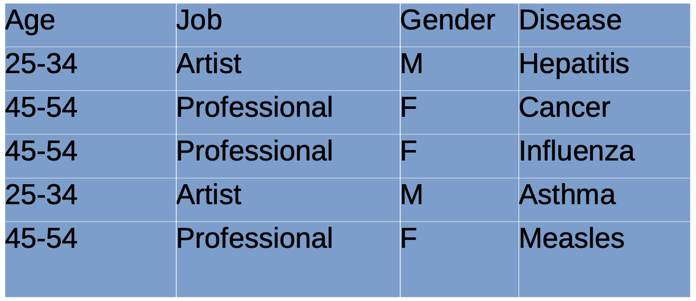
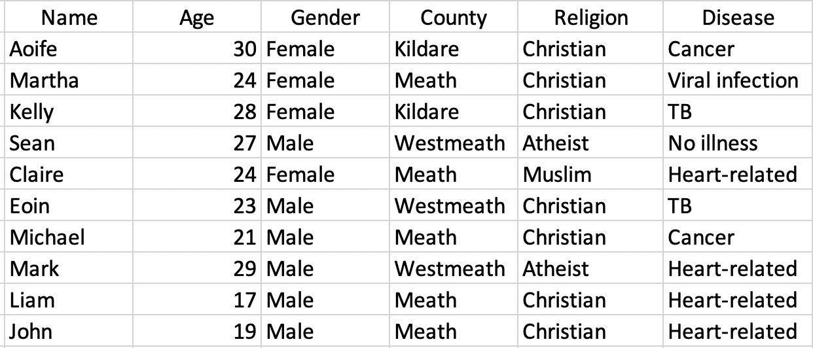
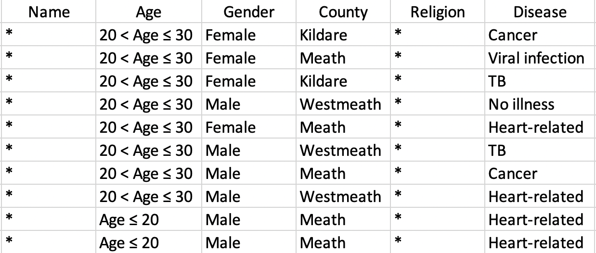

```{r setup, include=FALSE, eval=FALSE}
# Randomised response simulation
n <- 1000
p <- 0.2
truth <- rbinom(n, 1, p)

coin <- function() rbinom(1, 1, 0.5)

resp <- numeric(n)
for (i in 1:n) {
  toss <- coin()
  resp[i] <- ifelse(toss == 1, 1, truth[i])
}

# Estimated and true proportions
estimated <- sum(resp) - (n / 2)
estimated / n  # estimate
sum(truth) / n # actual
```

## Case Study: Location Tracking at Scale

-   Companies track smartphone users constantly, storing **billions** of data points.
-   The NY Times [Privacy Project](https://www.nytimes.com/interactive/2019/12/19/opinion/location-tracking-cell-phone.html) obtained one such file:
    -   50 **billion** location pings
    -   From over **12 million Americans** across 2016–2017

> *“You may think your location data is anonymous… it’s not.”*

### Why It's Hard to Hide

-   Imagine your **daily commute**: does anyone else’s phone follow your same path?
-   High-resolution geolocation data is *virtually impossible* to anonymise.
-   Paul Ohm:\
    \> *“DNA is probably the only thing that's harder to anonymise than geolocation data.”*

📖 [How iPhone apps track you](https://www.nytimes.com/wirecutter/blog/how-iphone-apps-track-you/)

------------------------------------------------------------------------

##  Data Anonymisation: What and Why

### Key Privacy Goals

**Disclosure Control**\
- Protect **individual identity**, allow **group-level insights**

**Privacy–Utility Trade-off**\
- Balance between **data usefulness** and **privacy risk**

------------------------------------------------------------------------

##  Privacy in the Digital Age


> “You have zero privacy anyway — get over it.”\
> — *Scott McNealy, Sun Microsystems CEO, 1999*

> “If you have something to hide, maybe you shouldn’t be doing it.”\
> — *Eric Schmidt, former Google CEO, 2009*

------------------------------------------------------------------------

## Defining Privacy

Dalenius (1977) on statistical data:

> *“Nothing can be learned about an individual from a released dataset that couldn’t be learned without it.”*

But…

-   If Alice knows Bob is **5cm shorter** than average...
-   And the **average** is published...
-   She now knows Bob's **exact height**

➡️ Highlights the power of **side information**

------------------------------------------------------------------------

## What Makes Data Personal?

### Attribute Types

| Type          | Examples                 |
|---------------|--------------------------|
| Identifiers   | Name, ID number, Email   |
| Sensitive     | Health, Salary, Religion |
| Non-sensitive | Age, Education |

🚨 Quasi-identifiers: seemingly benign attributes that, in combination, reveal identity.

------------------------------------------------------------------------

## Naive Anonymisation

-   Just removing identifiers **isn’t enough**
-   Combinations like **ZIP + Gender + DOB** identify **87%** of the U.S. population (Sweeney, 2000)



> 🏥 MA released "anonymous" health data.\
> 📋 L. Sweeney used a copy of voter records containing names as well as ZIP, gender and DOB and by cross-referencing the two datasets, she identified the state governor's records in the medical data!

------------------------------------------------------------------------

##  K-Anonymity

> Based on quasi-identifiers, make each person **indistinguishable** from at least $k-1$ others in a dataset.



### Techniques to Achieve K-Anonymity:

1.  **Suppression** – remove or mask values



2.  **Generalisation** – make values less specific



### Limitations

<!--  -->

-   **Homogeneity attack**: if all $k$ rows have same sensitive value, identity could be inferred.

    

-   If we know John, who's 19 years old and from Meath, is on the database, we can correctly infer he has a heart-related condition

------------------------------------------------------------------------

##  Beyond k-Anonymity

###  l-Diversity

-   Requires **diverse sensitive values** among $k$-group

### ️ Differential Privacy

-   Add **random noise** to numerical responses, but in such a way that aggregate results remain the same.
-   Ensures **individual contribution has minimal impact**
-   Widely used by **Apple**, **Google**, **US Census**

------------------------------------------------------------------------

## Other Techniques

### Microaggregation

-   Group records, replace sensitive value with **group average**
-   Preserves structure while hiding individuals

### Shuffling (Reverse Mapping)

1.  Model sensitive variable using public attributes\
2.  Predict & rank values\
3.  Shuffle original data based on these ranks\
4.  Result: **original values**, but **reordered**

### Randomised Response (Warner, 1965)

-   Coin flip decides if respondent answers truthfully
-   Provides **individual deniability**, preserves **population estimates**

## [An embarrassing survey](https://www.youtube.com/watch?v=nwJ0qY_rP0A)

##  Final Thoughts

-   **Perfect anonymisation is extremely difficult**
-   Privacy-preserving methods must consider:
    -   Side info
    -   Utility of data
    -   Statistical inference risks

> Remember:\
> Data can be anonymous in theory, but not always in practice.

------------------------------------------------------------------------

<!-- ## 📚 Further Reading -->

<!-- - [NYT Privacy Project](https://www.nytimes.com/series/new-york-times-privacy-project) -->

<!-- - Sweeney, L. (2000). Simple Demographics Often Identify People Uniquely. -->

<!-- - Dwork, C. (2006). Differential Privacy. -->
