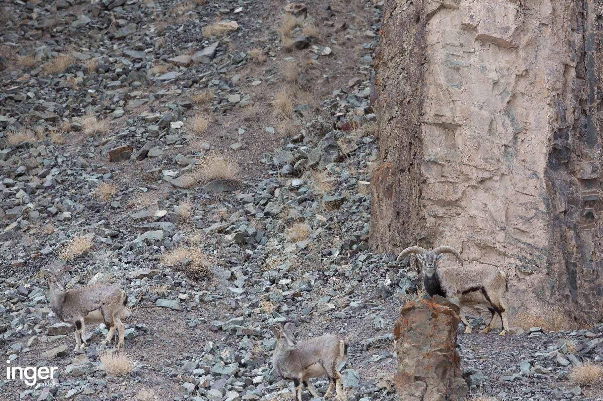
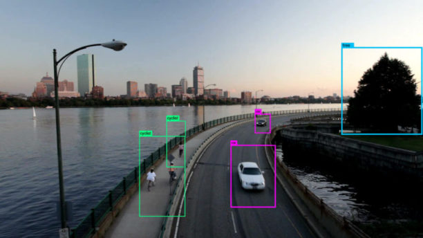
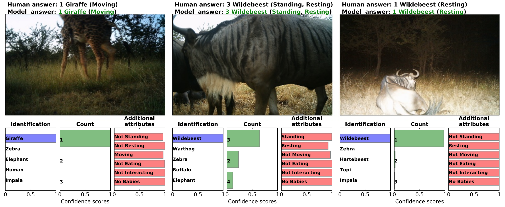
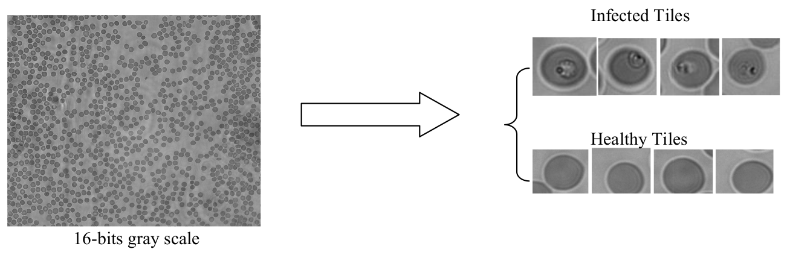
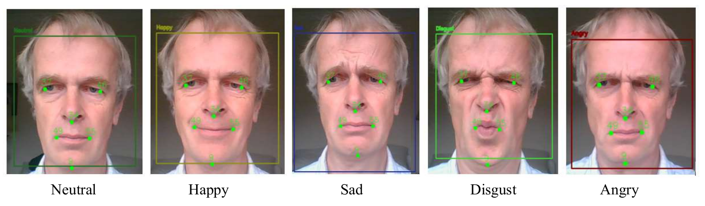
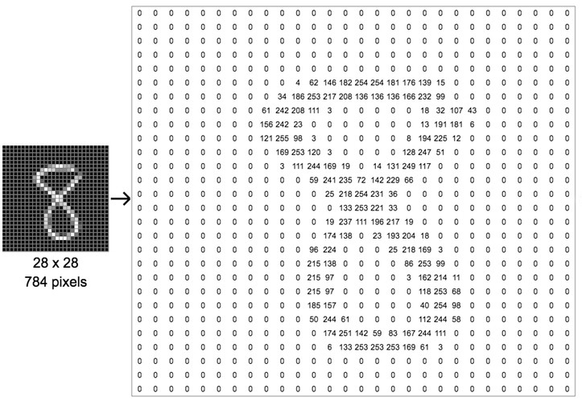

```{r setup, include=FALSE}
knitr::opts_chunk$set(echo = TRUE)
library(tidyverse)
library(tidytext)
library(stopwords)
library(class)

mnist_train <- readRDS("data/mnist_train.rds")
mnist_test <- readRDS("data/mnist_test.rds")
mnist_melted <- readRDS("data/mnist_melted.rds")

images_train <- readRDS("data/images_train.rds")
images_test <- readRDS("data/images_test.rds")

# pred_label_knn <- knn(mnist_train %>% select(-label), 
#                       mnist_test %>% select(-label), 
#                       cl = mnist_train$label , 
#                       k = 5)
# 
# 
# mnist_res <- mnist_test %>%
#                 select(label) %>% 
#                 mutate(pred_label = pred_label_knn)
# 


```

## Image Analysis

### Spot the snow leopard!



### Spot the spider!


### Image Analysis - Why?

The application of image analysis can be expanded to different domains of science, such as:

**Image detection on videos**



**Autonomous cars**


**Animals identification**



**Disease diagnosis**



<!-- **Measure Student Engagement** -->

<!--  -->


## Example: MNIST handwritten digit database

The dataset contains grayscale images of handwritten numbers at low resolution.

<!-- http://yann.lecun.com/exdb/mnist/ -->

<!-- -   70,000 grayscale images of handwritten numbers at low resolution (28 by 28 pixels) -->
<!-- -   Used 60,000 to train the algorithm and 10,000 to test -->

#### What does a computer "see"?

-   In essence, it sees an array of numbers representing colour intensities called pixels.
-   The pixel (a word invented from "picture element") is the basic unit of programmable color on a computer display or in a computer image.

#### Values in the  MNIST Dataset

1.  Pixel Values

-   Each pixel in an image is represented by a value from 0 to 255:

    -   0: Black (no ink)

    -   255: White (maximum ink)

    -   Intermediate values: Shades of gray

-   Sometimes we normalize these values to a range of \[0.0, 1.0\] or \[-1.0, 1.0\].

2.  Labels

-   Each image is labeled with the digit it represents: 0, 1, 2, ..., 9 (so 10 classes total)

#### Illustrative example of a single image



#### Visualising the numbers in the MNIST training dataset

The data needs to be reformatted for plotting. For example

```{r}
as_tibble(mnist_melted)
```

Then we can plot using standard ggplot methods. For example

```{r}
ggplot(mnist_melted, aes(x = x, y = y, fill = intensity)) +
  geom_tile() +
  scale_fill_continuous(name = "Pixel Intensity") +
  scale_y_reverse() +
  facet_wrap(~ image) +
  theme(
    strip.background = element_blank(),
    strip.text.x = element_blank(),
    panel.spacing = unit(0, "lines"),
    axis.text = element_blank(),
    axis.ticks = element_blank()
  ) +
  labs(
    title = "MNIST Image Data",
    subtitle = "Visualization of a sample of images contained in MNIST data set.",
    x = NULL,
    y = NULL
  )
```


#### Formatting data for analysis

If we assume each pixel is a feature/predictor then we should format that data such that the columns are pixels and each row corresponds to an image.

We'll work with a subset of the MNIST data and consider 1000 images in the training data and 100 images in the test data.

```{r}
mnist_train
```

```{r}
mnist_test
```

#### Image Classification Algorithms

-   Once we have a dataset we can use \textit{virtually ANY} supervised classification algorithm (each pixel is a "feature" or "predictor")
-   e.g. k-nearest neighbours, classification trees/random forests, logistic regression, support vector machines, neural networks
-   You have already studied a few of these techniques
-   We will use KNN for this analysis

#### Applying KNN

```{r image1}
library(class)
pred_label_knn <- knn(mnist_train %>% select(-label), 
                      mnist_test %>% select(-label), 
                      cl = mnist_train$label , 
                      k = 5)
pred_label_knn
```

#### Storing results

```{r image2}
mnist_res <- mnist_test %>%
                select(label) %>% 
                mutate(pred_label = pred_label_knn)

mnist_res
```

#### Calculating accuracy

```{r image3}
N <- nrow(mnist_res)

confusion_mat <- table(mnist_res %>% select(label, pred_label))
confusion_mat

accuracy <- (confusion_mat %>% diag %>% sum)/N
accuracy
```

## Example: Image Clasification

Suppose we want to classify images into 3 categories: 

- Plane ✈️ 
- Cat 🐱 
- German Shepherd 🐕


#### Loading Images in R

**How does a computer see these images?**

-   An image is made of **pixels**
-   Each pixel contains 3 values:
    -   Red (R)
    -   Green (G)
    -   Blue (B)
-   Each pixel is a combination of these three values
-   Values typically range from 0 to 255

Examples:

-   (255, 0, 0) → Red
-   (0, 255, 0) → Green
-   (0, 0, 255) → Blue

**R code**

```{r, eval = TRUE}
library(magick)

img <- image_read("images/plane.png")
plot(img)
```

-   `image_read()` loads images into R
-   Images are stored as special objects (not numeric yet)

#### Resizing Images

```{r, eval = TRUE}
img_scale <- image_scale(img, "100x100!")
plot(img_scale)
```

Why resize?

-   Ensures all images have same dimensions
-   Makes pixel vectors consistent length
-   Required for machine learning models

#### Extracting RGB Values

Images are converted into numbers for machine learning

```{r, eval = TRUE}
arr <- image_data(img, channels = "rgb")

r <- as.integer(arr[1,,])
g <- as.integer(arr[2,,])
b <- as.integer(arr[3,,])

r[1:10]
g[1:10]
b[1:10]
```

#### Building the Dataset

Now we need to build a dataset for image analysis

-   Combine RGB values into one long numeric vector per image
-   Each row in the dataset = one image
-   Each column = pixel intensity value
-   Row labels are the correct categories for the images
-   We will use:
    -   24 training images (stored in images_train)
    -   6 test images (stored in images_test)

#### K-Nearest Neighbours (KNN)

```{r}
library(class)

pred_label <- knn(
  train = images_train %>% select(-label),
  test  = images_test %>% select(-label),
  cl    = images_train %>% pull(label),
  k     = 6
)

```

#### Storing results

```{r}
image_res <- images_test %>%
  select(label) %>% 
  mutate(pred_label = pred_label)

image_res
```

#### Calculating accuracy

```{r}
N <- nrow(image_res)

confusion_mat <- table(image_res  %>% select(label, pred_label))
confusion_mat

accuracy <- (confusion_mat %>% diag %>% sum)/N
accuracy

```


#### Summary

1.  Load images (magick)
2.  Resize images
3.  Extract RGB values
4.  Convert to vectors
5.  Train KNN model
6.  Predict new images

**See image_analysis.R on the Rstudio server for the R code to run this analysis**